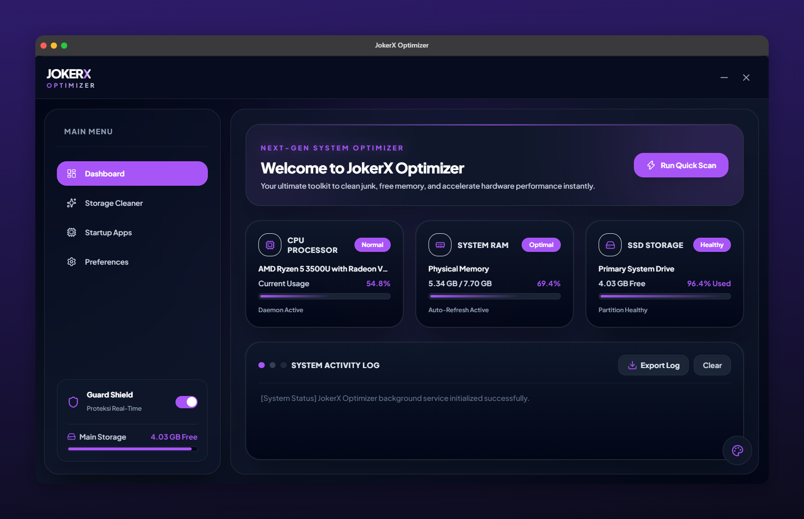

# JokerX Optimizer

JokerX Optimizer adalah aplikasi desktop utilitas untuk mengoptimalkan dan merawat sistem komputer. Dibangun dengan fokus pada performa tinggi, aplikasi ini menggabungkan antarmuka modern yang ringan dengan keamanan maksimal di balik layar berkat dukungan Rust dan Tauri.

<p align="center">
  
</p>

## Fitur Utama

- **Antarmuka Profesional (Enterprise UI):** Tampilan *dark mode* yang futuristik dan bersih, lengkap dengan konsol log aktivitas yang berjalan secara *real-time*.
- **Pembersihan Cache Mendalam:** Membersihkan file *temporary* sampah sistem untuk mengembalikan kapasitas penyimpanan.
- **Reset & Perbaikan Jaringan:** Melakukan *flush DNS* instan guna mengatasi masalah koneksi internet yang ngadat.
- **Arsitektur Ringan:** Mengandalkan *native code*, sehingga jauh lebih hemat RAM dibanding aplikasi desktop berbasis Electron biasa.

## Teknologi yang Digunakan

- **Frontend:**   
- **Backend:** 
- **Desktop Framework:** 

## Cara Menjalankan

Pastikan di komputer Anda sudah terinstal **Node.js**, **Rust**, dan dependensi Tauri yang diperlukan.

1. Clone repositorinya:
   ```bash
   git clone [https://github.com/iqbaalfd/jokerx-optimizer.git](https://github.com/iqbaalfd/jokerx-optimizer.git)
   cd jokerx-optimizer
2. Instal dependensi:
    ```bash
    npm install
3. Jalankan Mode Development
   ```bash
  npm run tauri dev